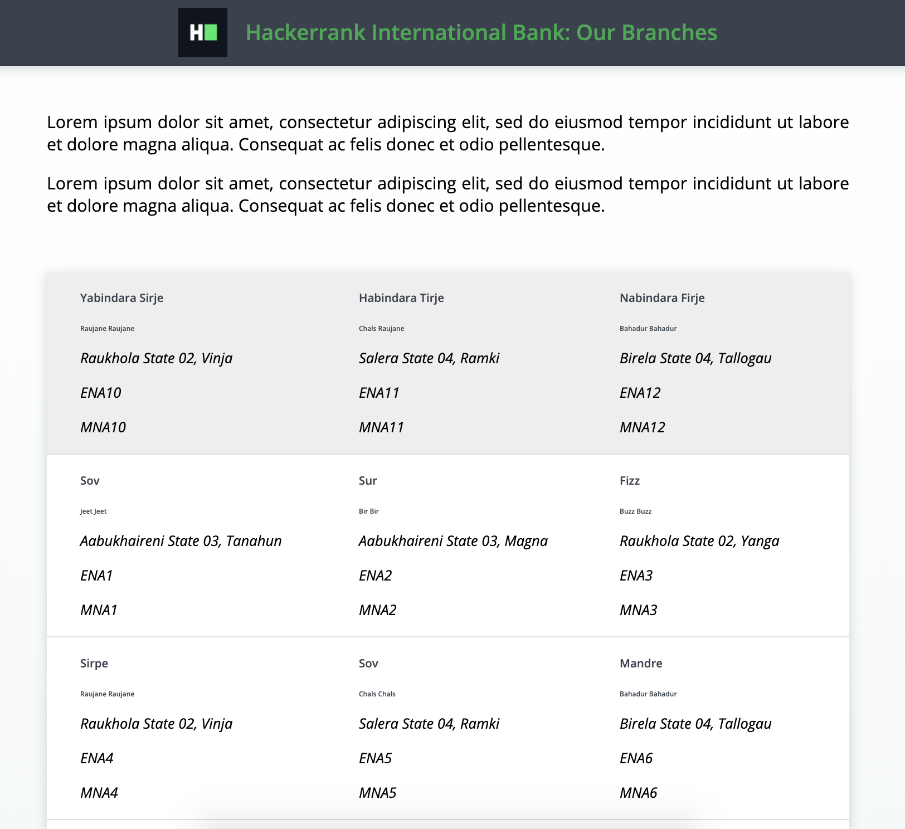

## Environment
- Java version: 17
- Maven version: 3.*
- Selenium HtmlUnitDriver: 2.52.0

## Read-Only Files
- src/test/*
- website/*
- src/main/java/com/hackerrank/selenium/server/*

## Commands
- run: 
```bash
mvn clean package && java -jar target/selenium-java-contact-scraping-1.0.jar
```
- install: 
```bash
mvn clean install
```
- test: 
```bash
mvn clean test
```

## Requirements
In this challenge, you are going to use the Selenium WebDriver, the _HtmlUnitDriver_, which uses the _HtmlUnit_ headless browser. This means you don't need to set up a browser (like Firefox or Chrome) or a web driver executable (like FirefoxDriver or ChromeDriver). Every web page has web elements (aka DOM objects) with unique names or IDs.

There is a class `WebScraper` that has 2 methods:

1. `scrapeEmailAddresses`:
   - It needs to scrape all the unique email addresses present on the given page.
   - The only requirement to be an email address is to have the *@* character.
   - Examples of valid email addresses: *P@P.IJ, as@as.lA, Gnoy@Gnoy.ki, r@r.yd*.
   - The return type is a list of email addresses.

2. `scrapeMobileNumbers`:
   - It needs to scrape all the unique mobile numbers present on the given page.
   - The only requirement to be a mobile number is to have 10 digits.
   - Examples of valid mobile numbers: *8853248887, 1435416774, 8467324364, 1748528383*.
   - The return type is a list of string mobile numbers.

These methods have 2 parameters, one web driver and one web page URL. The supplied web page will look like the following:



**Hint**: The DOM structure of the given page will be the same as on website/home.html. You can look at the source code of this file to know the HTML structure of the given page. Remember, the content will be different on each run of the project or test.

Your task is to complete the implementation of these 2 methods so that the unit tests pass while running the tests.

## Example Actions
```
//initialize web driver
WebDriver driver = new HtmlUnitDriver();

//find input elements inside form
List elements = WebScraper.scrapeEmailAddresses(driver, "http://localhost:8080/home.html");

//Print
System.out.println("Elements:"  + elements);
```
